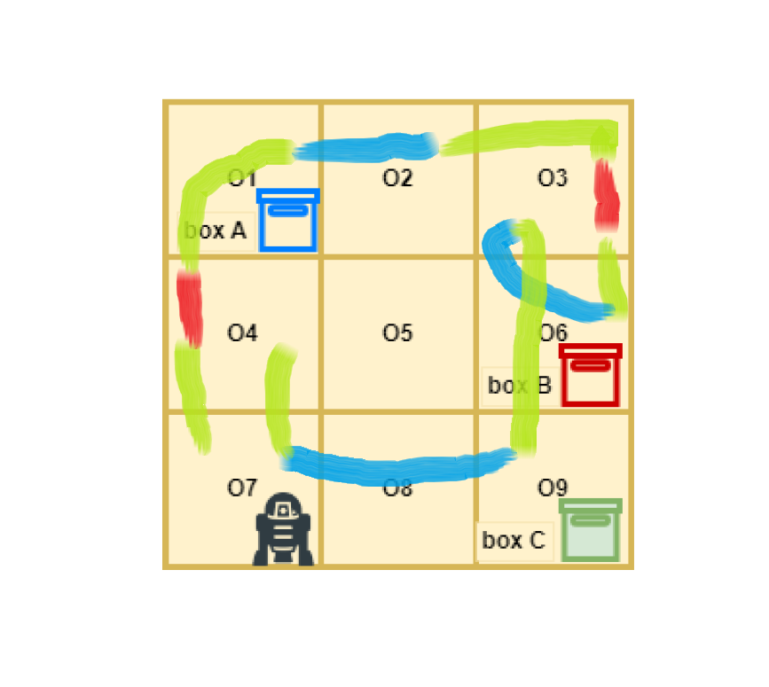
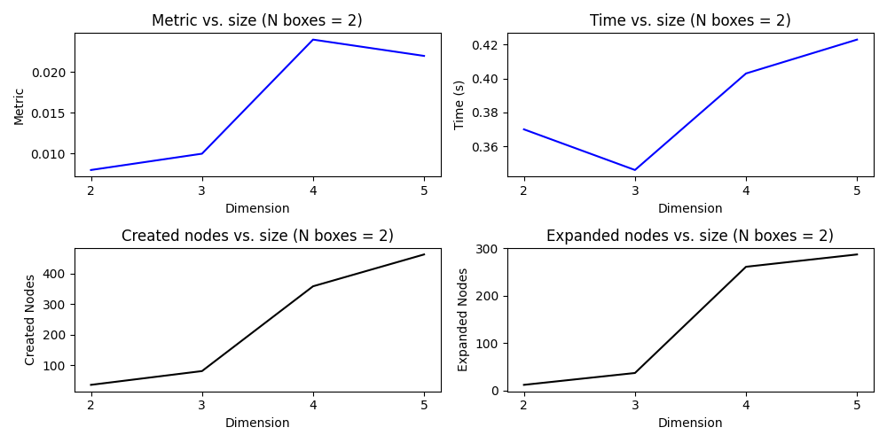
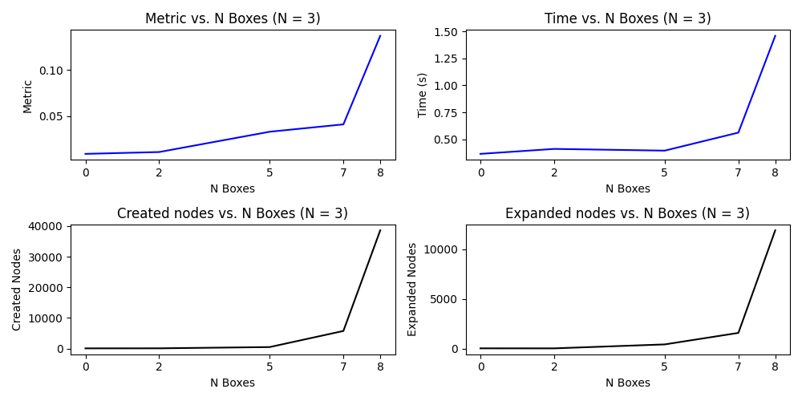

Practical Exercise: Cleaner Robotic Task
-------

<!-- Create a colored box with author name and institution -->

<div class="alert alert-block alert-info" style="text-align: center;">
<b>Author:</b> Becerra Tomé, Alberto<br>
<b>University:</b> Universitat Rovira i Virgili<br>
<b>Course:</b> Planning and Approximate Reasoning<br>
</div>

<br>

- [1. Introduction](#1-introduction)
- [2. Planning method](#2-planning-method)
  - [2.1. Search algorithm](#21-search-algorithm)
- [3. Problem Analysis](#3-problem-analysis)
  - [3.1. Predicates](#31-predicates)
  - [3.2. Initial and Goal States](#32-initial-and-goal-states)
    - [3.2.1. Initial State](#321-initial-state)
    - [3.2.2. Goal State](#322-goal-state)
- [4. Implementation](#4-implementation)
  - [4.1. Testing](#41-testing)
    - [4.1.1. Test case 1: Just Move (Longest Path)](#411-test-case-1-just-move-longest-path)
    - [4.1.2. Test case 2: Just Stay](#412-test-case-2-just-stay)
    - [4.1.3. Test case 3: Clean and Move](#413-test-case-3-clean-and-move)
    - [4.1.4. Test case 4: Clean and Return](#414-test-case-4-clean-and-return)
  - [4.2. Analysis](#42-analysis)
- [Conclusions](#conclusions)
- [Future Work](#future-work)
- [Appendix](#appendix)
  - [Appendix A: PDDL Code Main Problem](#appendix-a-pddl-code-main-problem)
  - [Appendix B: PDDL Code Test Case 1](#appendix-b-pddl-code-test-case-1)
  - [Appendix C: PDDL Code Test Case 2](#appendix-c-pddl-code-test-case-2)
  - [Appendix D: PDDL Code Test Case 3](#appendix-d-pddl-code-test-case-3)
  - [Appendix E: PDDL Code Test Case 4](#appendix-e-pddl-code-test-case-4)

# 1. Introduction
This work presents a Planning and Approximate Reasoning (PAR) approach to tackle the problem of cleaning a square building composed of $N^2$ offices using a robotic cleaner. The goal is to design and implement a PDDL-based planner to efficiently guide the robot through the building, cleaning offices, and potentially pushing boxes to designated locations to achieve a clean and organized state.

The problem involves a grid of offices where the robot, named `PR2`, can move horizontally or vertically between adjacent offices. The initial configuration includes dirty and clean offices, along with the presence of boxes in certain locations. Various actions, such as cleaning offices, moving between them, and pushing boxes, are to be defined in PDDL to represent the robot's behavior. Additionally, predicates are introduced to capture essential aspects of the world, including the robot's location, box positions, office cleanliness, and adjacency relationships.


The objective is to reach a predefined goal state where all offices are clean, and boxes are correctly positioned. The work outlines the process of implementing the PDDL planner, defining the domain and problem, and extensively testing the solution on a range of test cases of increasing complexity. The document not only discusses the final path but also delves into the solutions found by the planner and the optimality of the plans.

The report concludes with an analysis of the problem's complexity and the number of nodes generated and expanded during planning. The proposed approach offers insights into the PAR paradigm for solving real-world robotic tasks, specifically focusing on efficient cleaning in dynamic environments.


# 2. Planning method
The planning method used in this work is STRIPS. The Stanford Research Institute Problem Solver, known by its acronym STRIPS, is an automated planner developed by Richard Fikes and Nils Nilsson in 1971 at SRI International.

A STRIPS instance is composed of:

- An initial state
- The specification of the goal states – situations that the planner is trying to reach
- A set of actions. For each action, the following are included:
    - preconditions (what must be established before the action is performed)
    - postconditions (what is established after the action is performed).

Another action definition can be specified using preconditions, add list and delete list. However, in this case, the previous definition is used.

## 2.1. Search algorithm

In this work, the search algorithm is set by default by the planner. In this case, the used one is Iterative Width (IW), a highly effective blind search algorithm that is driven by the intuition that the original problem also has a small width. IW performs a series of iterations over the width w in increasing order. The w-th teration, denoted as IW(w), performs a breadth-first search that enumerates optimal plans for every condition whose width is less than or equal to w. 

IW(w) is guaranteed to solve a problem whose width is below w. While it runs in time exponential in w, low-w iterations run quickly and efficiently by keeping track of a novelty metric of each search state and
pruning the states with novelty larger than w.

The depth is the number of actions which are run in parallel in a certain moment in the plan. In our concrete problem, every action runs sequentially so the width is 1.

# 3. Problem Analysis

Previously to the predicates definition and with the purposes of having clean code and clean output, the following types are defined:

```lisp
(:types
    box - movable 
    robot - movable 
    office)
```	

where `movable` is a type that includes `box` and `robot` types.

In addition to this and given that there is always just one robot, the following constant is defined:

```lisp
(:constants
    R - robot)
```

## 3.1. Predicates

The used predicates are the following:

- at($m$, $o$): The movable object $m$ is at office $o$
- adj($o_1$, $o_2$): Offices $o_1$ and $o_2$ are adjacent
- dirty($o$): The office $o$ is dirty
- empty($o$): The office $o$ is empty (no boxes in it)

```lisp
(:predicates
        (at ?m - movable ?o - office) ; The object B is at office o
        (adj ?o1 ?o2 - office) ; The offices o1 and o2 are adjacent
        (dirty ?o - office) ; The office o is dirty
        (empty ?o - office) ; There is no box at office o
)
```	
## 3.2. Actions

- **Clean($o$)**: The robot cleans the office $o$. The precondition is that the robot is at the office $o$ and the effect is that the office $o$ is not dirty.
    - **Precondition**: at(R, $o$) $\land$ dirty($o$)
    - **Effect**: $\neg$ dirty($o$)
    ```lisp	
    (:action clean
        :parameters (?o - office)
        :precondition (and (at R ?o) ; The robot is at office o
                        (dirty ?o) ; The office o is dirty
                        )
        :effect (and (not (dirty ?o)) ; The office o is not dirty anymore
                )
    )
    ```	

- **Move($o_1$, $o_2$)**: The robot (R) moves from office $o_1$ to office $o_2$. The precondition is that the robot is at the office $o_1$, both offices are adjacent and the effect is that the robot is at the office $o_2$.
    - **Precondition**: at(R, $o_1$) $\land$ adj($o_1$, $o_2$)
    - **Effect**: at(R, $o_2$) $\land$ $\neg$ at($o_1$)

    ```lisp
    (:action move
        :parameters (?o1 ?o2 - office)
        :precondition (and (adj ?o1 ?o2) ; Both offices are adjacent
                            (at R ?o1) ; The robot is at office o1
                    )
        :effect (and (not (at R ?o1)) ; The robot is not at office o1 anymore
                    (at R ?o2) ; The robot is now at office o2
                )
    )
    ```
- **Push($B$, $o_1$, $o_2$)**: The robot pushes the box (B) from office $o_1$ to office $o_2$. The precondition is that the robot is at the office $o_1$, both offices are adjacent and office $o_2$ is empty. The effect is that the box is at the office $o_2$ and the office $o_1$ is empty. The robot displaces itself to the office $o_2$.
    - **Precondition**: at(R, $o_1$) $\land$ adj($o_1$, $o_2$) $\land$ at($B$, $o_1$) $\land$ empty($o_2$)
    - **Effect**: at($B$, $o_2$) $\land$ empty($o_1$) $\land$ at(R, $o_2$) $\land$ $\neg$ at(R, $o_1$) 
```lisp
(:action push
    :parameters (?B - box ?o1 ?o2 - office)
    :precondition (and (at R ?o1) ; The robot is at office o1
                       (adj ?o1 ?o2) ; Both offices are adjacent
                       (at ?B ?o1) (empty ?o2) ; The box B is at o1 and o2 is empty
                   )
    :effect (and (at R ?o2) (not (at R ?o1)) ; Move the robot to o2
                 (at ?B ?o2) (not (at ?B ?o1)) ; Move the box to o2
                 (not (empty ?o2)) (empty ?o1) ; o2 is not empty anymore and o1 is empty
            )
)
```

## 3.2. Initial and Goal States

### 3.2.1. Initial State
The **initial state** of any problem related to our domain is composed as follows:

- **Predicates**: 
    - Adjacency definition for all offices (adj($o_i$, $o_j$))
    - Dirty offices declaration (dirty($o_k$))
    - Box location definition for all offices (at($B$,$o_l$) and empty($o_t$))
    - Robot is at a concrete office (at(R, $o_m$))

where $i, j, k, l, m, t \in \{0, \dots , N^2 - 1\}$ and $N$ is the size of the problem.

Example for $N$ equal to 2:

```lisp
(:objects
    o1 o2 o3 o4 - office ; Offices
    A - box B - box   ; Boxes
)

(:init
    (adj o1 o2) (adj o1 o3) 
    (adj o2 o1) (adj o2 o4) 
    (adj o3 o1) (adj o3 o4) 
    (adj o4 o2) (adj o4 o3) ; Adjacency definition

    (dirty o1) (dirty o4) ; Dirty offices

    (at A o1) (empty o2)
    (empty o3) (at B o4) ; Box position definition

    (at R o1) ; Robot is at office o1
)
```

### 3.2.2. Goal State
The **final state** of any problem related to our domain is composed as follows:

- **Predicates**: 
    - All dirty offices in the initial state are clean (not dirty($o_j$))
    - Robot is at a concrete office (at(R, $o_m$))
    - All boxes are at the office where they should be (at($B$, $o_l$))

where $j, l, m \in \{0, \dots , N^2 - 1\}$ and $N$ is the size of the problem.

Example:
```lisp	
(:goal (and
    ; Robot final location
    (at R o4)

    ; Clean offices
    (not (dirty o1))
    (not (dirty o4))

    ; Boxes final locations
    (at A o2) (at B o3)

))
```

# 4. Implementation

The implementation of the planner is done in PDDL language and the planner used is the one provided by the course. 

The main example used for the development of the initial solution is the one provided in the problem statement. The following image shows the initial and final states of the problem:


The following image shows the solution found by the planner ($o_4$ and $o_3$ are dirty):




So the robot:

1. Goes to $o_4$ and cleans it
2. Goes to $o_1$ and pushes the box $A$ to $o_2$
3. Goes to $o_3$ and cleans it
4. Goes to $o_9$ through $o_6$ and pushes the box $B$ to $o_7$
5. It goes to the final location $o_4$

So that the final state is successfully reached.

In terms of the search process, the returned output is the following:

```lisp
Plan found with cost: -1.55484e+12
Nodes generated during search: 104
Nodes expanded during search: 43

Metric: 0.013000000000000001
Makespan: 0.013000000000000001
States evaluated: undefined
Planner found 1 plan(s) in 0.622secs.
``````

This problem is going to be taken as a baseline for comparison with the rest of the test cases.

## 4.1. Testing

For testing purposes, the following test cases are used:

- **Test case 1**: Size 3x3. Move from $o_1$ to $o_9$. There are no boxes to push and the offices are clean.
- **Test case 2**: Size 3x3. Move from $o_1$ to $o_1$ (stay). There are no boxes to push and the offices are dirty.
- **Test case 3**: Size 3x3. Move from $o_1$ to $o_9$. There are no boxes to push and the all the offices are dirty.
- **Test case 4**: Size 3x3. Move from $o_1$ to $o_1$ (stay). There are no boxes to push and the all the offices are dirty.

### 4.1.1. Test case 1: Just Move (Longest Path)

The aim of this test is to check that the actions can be run individually and that the robot can move from one office to another. The following image shows the final plan:

<!-- Add in two columns the plan and the grid for test 1  -->


The planner decided to move the robot following the diagonal path (the shortest one).

```lisp
Plan found with cost: 4
Nodes generated during search: 21
Nodes expanded during search: 11

Metric: 0.004
Makespan: 0.004
States evaluated: undefined
Planner found 1 plan(s) in 0.447secs.
```

This test case, as it hasn't almost any constraint, is the most efficient one, having a cost much lower than the rest of the test cases. Only 21 nodes are generated and 11 expanded in the search tree.

### 4.1.2. Test case 2: Just Stay

In this test, the initial and the final states were the same office. In this case, no plan could be found because there's no `stay` action.

### 4.1.3. Test case 3: Clean and Move

In this test, the robot has to clean all the offices and move from $o_1$ to $o_9$. The following image shows the final plan:


In this case, the planner decided to clean the offices first and then move the robot to the final location [1 - 2 - 5 - 4 - 7 - 8 - 9 - 6 - 3 - 6 - 9].

The output of the planner is the following:

```lisp
Plan found with cost: 7.96205e+17
Nodes generated during search: 81
Nodes expanded during search: 28

Metric: 0.019
Makespan: 0.019
States evaluated: undefined
Planner found 1 plan(s) in 0.298secs
```

Even not having boxes, the cost of this plan is higher than the one of the main example. This is because the robot has to clean all the offices before moving to the final location so the cost of the plan is higher due to this constraint.

### 4.1.4. Test case 4: Clean and Return

In this case, the plan is similar to the previous one but the robot has to return to the initial location. The following image shows the final plan:


The output of the planner is the following:

```lisp	
Plan found with cost: 19
Nodes generated during search: 76
Nodes expanded during search: 27

Metric: 0.019
Makespan: 0.019
States evaluated: undefined
Planner found 1 plan(s) in 0.284secs.
```

The cost of this plan is almost the same as the one of the previous test case. This is because the robot has to clean all the offices before moving to the final location so the cost of the plan is higher due to this 
constraint. The differences are due just to the different path that the robot has to follow to return to the initial location.

## 4.2. Analysis

In this section, the complexity of the problem is analyzed after varying the size of the problem and the number of boxes. 

It is not trivial to compare the complexity fixing the rest of the parameters because, for example, for different sizes, the same number of boxes can be located in many different places. In this case, the simmetry of the problems have been tried to keep in all the cases.

- Analysis of the size: 2 boxes and 2 dirty offices in similar positions keeping simmetry as much as possible.
- Analysis of the number of boxes: 3x3 grid with 2 dirty offices in similar positions keeping simmetry as much as possible.

The following imageS sçhow the results of the analysis:





From this analysis, and with the specific settings for our analysis, it can be concluded that the complexity of the problem is exponential with respect to the size of the problem and the number of boxes.

# Conclusions

From this work, it can be concluded that the PAR paradigm is a very powerful tool to solve real-world problems. In this case, the problem of cleaning a building with a robot has been solved using a PDDL planner. The planner has been tested with different test cases and the results have been analyzed.

For this configuration, the complexity of the problem is exponential with respect to the size of the problem and the number of boxes. This is because the planner has to explore all the possible paths to find the optimal one.

It has been shown the influence of the constraints in the cost of the plan. In the case of having to clean all the offices before moving to the final location, the cost of the plan is higher than the one of just moving to the final location.

Finally, it has been seen that the planner is able to find the optimal solution in a reasonable time. This is because the planner is able to prune the search tree and avoid exploring paths that are not optimal.

# Future Work

In this work, the planner has been tested with a small number of test cases. In the future, it would be interesting to test the planner with more test cases and with different configurations to see how the planner behaves.

Finally, another interesting point to analyze is the influence of the search algorithm in the cost of the plan. In this work, the search algorithm has been fixed by default but it would be interesting to analyze the influence of the search algorithm in the cost of the plan. Benchmarking different planners and different search algorithms would be a good starting point for future analysis. 


# Appendix

## Appendix A: PDDL Code Main Problem

```lisp
(define (problem clean-robot) (:domain clean-robot)
(:objects
    o1 o2 o3 o4 o5 o6 o7 o8 o9 - office ; Offices
    A - box B - box C - box    ; Boxes
)

(:init

 ; Adjacency conditions
 (adj o1 o2) (adj o2 o1)
 (adj o1 o4) (adj o4 o1)

 (adj o2 o5) (adj o5 o2)
 (adj o2 o3) (adj o3 o2)

 (adj o3 o6) (adj o6 o3)
 (adj o4 o5) (adj o5 o4)

 (adj o4 o7) (adj o7 o4)
 (adj o5 o6) (adj o6 o5)

 (adj o5 o8) (adj o8 o5)
 (adj o6 o9) (adj o9 o6)

 (adj o7 o8) (adj o8 o7)
 (adj o8 o9) (adj o9 o8)
 
 ; Robot initial location
 (at R o7)

 ; Box initial locations map
 (at A o1) (empty o2) (empty o3) 
 (empty o4) (empty o5) (at B o6) 
 (empty o7) (empty o8) (at C o9)

 ; Dirty offices
 (dirty o3)
 (dirty o4)

)

(:goal (and
    ; Robot final location
    (at R o4)

    ; Clean offices
    (not (dirty o3))
    (not (dirty o4))

    ; Boxes final locations
    (at A o2) (at B o3) (at C o7)

))
)
```

## Appendix B: PDDL Code Test Case 1

```lisp
(define (problem MOVEITOF) (:domain clean-robot)
(:objects
    o1 o2 o3 o4 o5 o6 o7 o8 o9 - office ; Offices
)

(:init

 ; Adjacency conditions
 [...]
 
 ; Robot initial location
 (at R o1)
)

(:goal (and
    ; Robot final location
    (at R o9)

    ; Clean offices
))
)
```

## Appendix C: PDDL Code Test Case 2

```lisp
(define (problem MOVEITOI) (:domain clean-robot)
(:objects
    o1 o2 o3 o4 o5 o6 o7 o8 o9 - office ; Offices
)

(:init

 ; Adjacency conditions
 [...]
 
 ; Robot initial location
 (at R o1)
)

(:goal (and
    ; Robot final location
    (at R o1)

    ; Clean offices
))
)
```

## Appendix D: PDDL Code Test Case 3

```lisp
(define (problem MOVEITOFAD) (:domain clean-robot)
(:objects
    o1 o2 o3 o4 o5 o6 o7 o8 o9 - office ; Offices
)

(:init

 ; Adjacency conditions
 [...]
 
 ; Robot initial location
 (at R o1)

 (dirty o1) (dirty o2) (dirty o3) 
 (dirty o4) (dirty o5) (dirty o6) 
 (dirty o7) (dirty o8) (dirty o9)
)

(:goal (and
    ; Robot final location
    (at R o9)

    ; Clean offices
    (not (dirty o1)) (not (dirty o2)) (not (dirty o3))
    (not (dirty o4)) (not (dirty o5)) (not (dirty o6))
    (not (dirty o7)) (not (dirty o8)) (not (dirty o9))
))
)
```

## Appendix E: PDDL Code Test Case 4

```lisp
(define (problem MOVEITOIAD) (:domain clean-robot)
(:objects
    o1 o2 o3 o4 o5 o6 o7 o8 o9 - office ; Offices
)

(:init

 ; Adjacency conditions
[...]
 
 ; Robot initial location
 (at R o1)

 (dirty o1) (dirty o2) (dirty o3) 
 (dirty o4) (dirty o5) (dirty o6) 
 (dirty o7) (dirty o8) (dirty o9)
)

(:goal (and
    ; Robot final location
    (at R o1)

    ; Clean offices
    (not (dirty o1)) (not (dirty o2)) (not (dirty o3))
    (not (dirty o4)) (not (dirty o5)) (not (dirty o6))
    (not (dirty o7)) (not (dirty o8)) (not (dirty o9))
))
)
```
