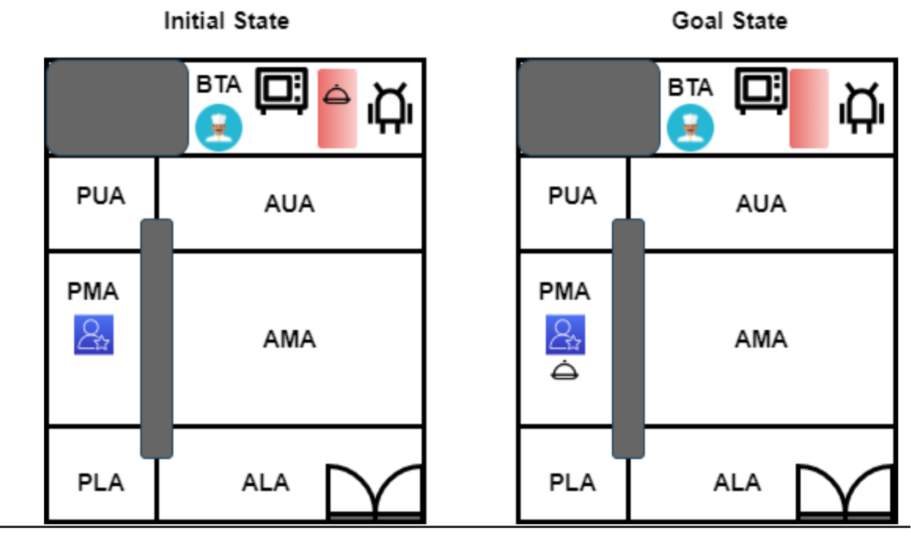
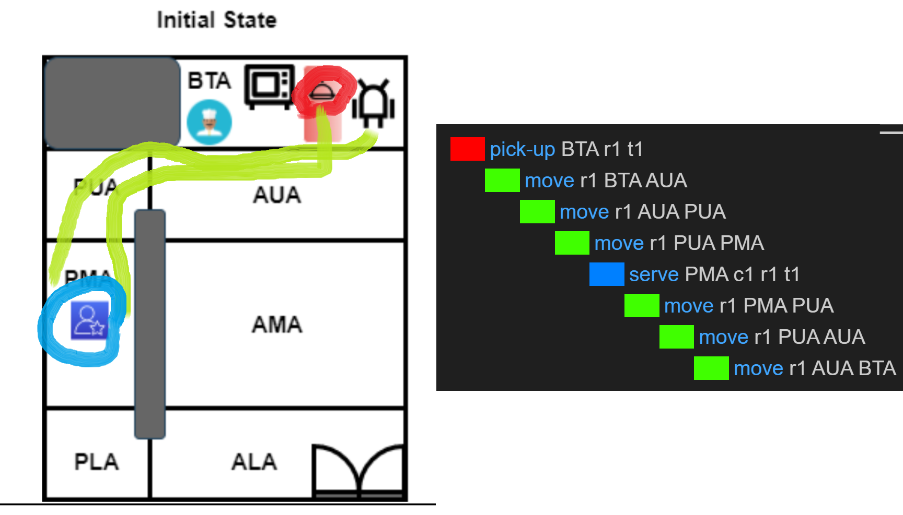
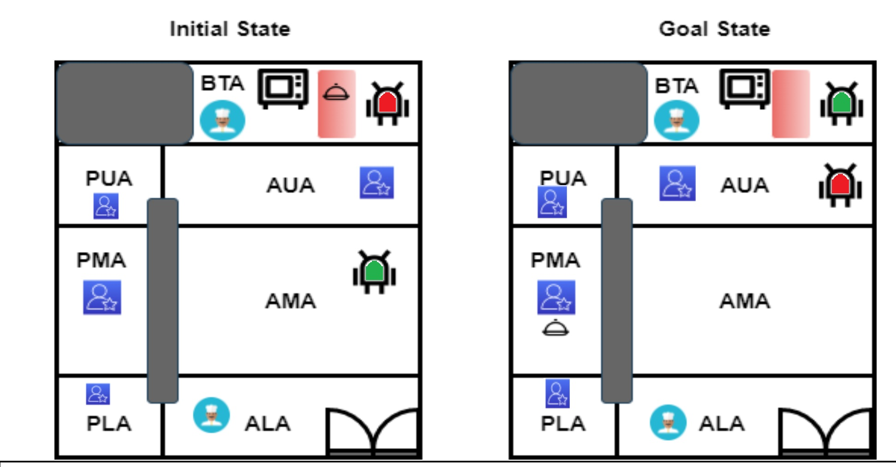
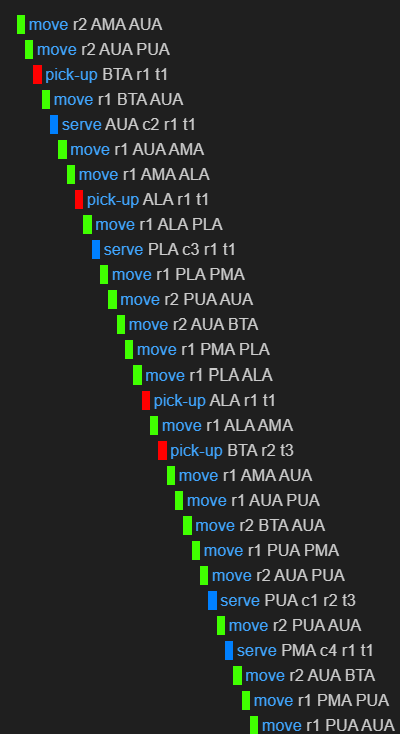
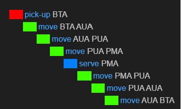
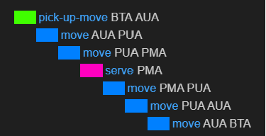
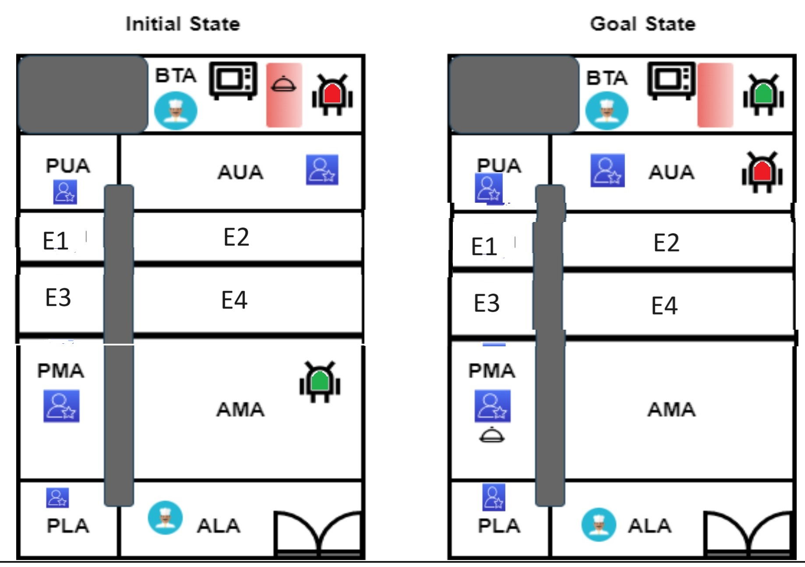
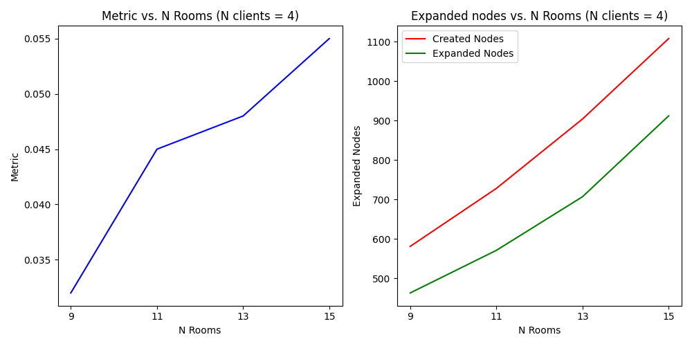
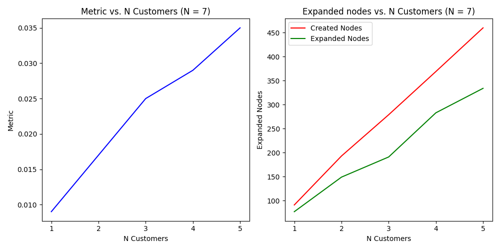

Practical Exercise: Planning and Execution of a Robotic Waiter Task in a Restaurant Setting
-------

<!-- Create a colored box with author name and institution -->

<div class="alert alert-block alert-info" style="text-align: center;">
<b>Author:</b> Becerra Tomé, Alberto<br>
<b>University:</b> Universitat Rovira i Virgili<br>
<b>Course:</b> Planning and Approximate Reasoning<br>
</div>

<br>

- [1. Introduction](#1-introduction)
- [2. Planning method](#2-planning-method)
  - [2.1. Search algorithm](#21-search-algorithm)
- [3. State Space Analysis](#3-state-space-analysis)
  - [3.1. General Approach](#31-general-approach)
  - [3.2. Constrained Approach](#32-constrained-approach)
    - [3.2.1. Test Example Size](#321-test-example-size)
- [4. PDDL Approach](#4-pddl-approach)
  - [4.1. General version](#41-general-version)
  - [4.2. Example of complex problem using this general approach](#42-example-of-complex-problem-using-this-general-approach)
  - [4.3. Problem Simplification](#43-problem-simplification)
  - [4.4. Further optimization](#44-further-optimization)
  - [4.5. Conclusions about implementation](#45-conclusions-about-implementation)
- [5. Testing](#5-testing)
- [6. Conclusions](#6-conclusions)
- [7. Future Work](#7-future-work)
- [Appendix A: General implementation](#appendix-a-general-implementation)
  - [A.1 Complex Problem Implementation](#a1-complex-problem-implementation)
  - [A.2 Simple Problem with general approach](#a2-simple-problem-with-general-approach)
- [Appendix B: Specific implementation](#appendix-b-specific-implementation)
  - [B.1 Simple Problem in Specific Implementation](#b1-simple-problem-in-specific-implementation)
- [Appendix C: Improved Specific Implementation](#appendix-c-improved-specific-implementation)
  - [C.1 Simple Problem in Improved Specific Implementation](#c1-simple-problem-in-improved-specific-implementation)

# 1. Introduction

This work involves developing a planning and execution system for robotic waiters at HANAKI, a Japanese restaurant in Barcelona. The objective is to employ these robotic agents to serve food to customers efficiently and autonomously.

The task involves designing a system where robotic waiters can pick up plates of food from a buffet area, navigate a discretely mapped restaurant, and serve the food to customers located in various areas within the restaurant. Customers place their orders through a mobile app, simplifying the task. The robot's movement is discrete, and it cannot move through areas blocked by walls. 

To solve this problem, the world is defined using predicates, representing relationships between locations, plates, customers, and their states. Actions include picking up a plate, serving a customer, filling a plate with food, and moving between adjacent locations. Additional actions can be introduced for optimization.

The planner is modeled using PDDL (Planning Domain Definition Language) and tested with various scenarios of increasing complexity.

The documentation for this exercise should includes an introduction to the problem, an analysis of the problem's components (objects, operators, predicates), the PDDL implementations, testing cases and their results, and an analysis of the complexity and number of nodes generated and expanded during planning. 

# 2. Planning method
The planning method used in this work is STRIPS. The Stanford Research Institute Problem Solver, known by its acronym STRIPS, is an automated planner developed by Richard Fikes and Nils Nilsson in 1971 at SRI International.

A STRIPS instance is composed of:

- An initial state
- The specification of the goal states – situations that the planner is trying to reach
- A set of actions. For each action, the following are included:
    - preconditions (what must be established before the action is performed)
    - postconditions (what is established after the action is performed).

Another action definition can be specified using preconditions, add list and delete list. However, in this case, the previous definition is used.

## 2.1. Search algorithm

In this work, the search algorithm is set by default by the planner. In this case, the used one is Iterative Width (IW), a highly effective blind search algorithm that is driven by the intuition that the original problem also has a small width. IW performs a series of iterations over the width w in increasing order. The w-th teration, denoted as IW(w), performs a breadth-first search that enumerates optimal plans for every condition whose width is less than or equal to w. 

IW(w) is guaranteed to solve a problem whose width is below w. While it runs in time exponential in w, low-w iterations run quickly and efficiently by keeping track of a novelty metric of each search state and
pruning the states with novelty larger than w.

The depth is the number of actions which are run in parallel in a certain moment in the plan. In our concrete problem, every action runs sequentially so the width is 1.

# 3. State Space Analysis

## 3.1. General Approach

In fist place, let's parametrize a general version of the problem. 

**General Problem Statement**: In a restaurant with $N_S$ rooms, there are $N_R$ robots, each one with a capacity of carrying $N_P$ plates simultaneously. In the restaurant, there are $N_C$ customers which want to be served.

Without loss of generality, it can be assumed that there is one customer per room ($N_S$ can be recalculated in a new discretization of the problem).

Metapredicates:

-  The $N_R$ robots have $N_S$ places where they can be. Supposing that they can't be in the same place at the same time, these are $V_{N_S, N_R}$ posibilities, where $V_{n,k}$ refers to variations of $n$ elements in groups of $k$.

$$
V_{N_S, N_R} = \dfrac{N_S!}{(N_S - N_R)!}
$$

- The same calculation can be done with the possible locations of the customers.

- Each of the robots can have $2^{N_P}$ possible plates dispositions or empty espaces por a new plate.

- Each of the clients can be served or not. Here another extra $2^{N_C}$ posibilities.

Based on the previous metapredicates, a point in our state space looks like this:

$$
s = (r_{1}, \dots, r_{N_S}, c^1_{1}, \dots, c^1_{N_S},\dots c^{N_C}_1, \dots, c^{N_C}_{N_S}, p^1_{empty}, \dots, p^{N_P}_{empty}, c^1_{served}, \dots, c^{N_C}_{served})
$$

And thus, the number of possible states is

$$
\dfrac{N_S!}{(N_S - N_R)!}\dfrac{N_S!}{(N_S - N_C)!}2^{N_P}2^{N_C}
$$

## 3.2. Constrained Approach

In the problem statement, there is only one robot, i.e., $N_R$ is one. Getting reduced the problem to

$$
N_S\dfrac{N_S!}{(N_S - N_C)!}2^{N_P + N_C}
$$

If $N_S$ >> $N_C$, then it is approximately

$$
2^{N_P + N_C}N_S
$$

Otherwise, if $N_S$ = $N_C$, 

$$
2^{N_P + N_S}N_SN_S!
$$

In both cases, the size of the problem increases exponentially with the number of possible rooms.

If $N_S$ is fixed, rewriting the first expression, the size is

$$
N_S\times N_S(N_S - 1)\cdots(N_S - N_C + 1)\times2^{N_P + N_C}
$$

which is also exponential but grows lower than in the case of the rooms given that the polynomic component decreases when the exponential grows.

### 3.2.1. Test Example Size

In the test provided, $N_S$ is 7, $N_C$ is 1 and $N_P$ is also 1. It is assumed that the clients can't be in the kitchen so for the clients the number or rooms is 6.

The number of states in the test problem is

$$
7\dfrac{6!}{(6 - 1)!}2^{1+1} = 7 \times 6 \times 4 = 168 
$$


# 4. PDDL Approach

## 4.1. General version

In the general version:
- There can be more than one robot.
- There can be more than one customer.
- There can be more than one plate per robot because they have trays for different plates.
- There can be more than one kitchen.
- The robots can't be in the same room at the same time.
- The customers can't be in the same room at the same time.

Previously to the predicates definition and with the purposes of having clean code and clean output, the following types are defined:

```lisp
(:types
    robot - physic
    customer - physic
    kitchen - loc
    room - loc
    tray
 )
```	

where `physic` is a type that includes `customer` and `robot` types. Basically it means that they are objects that need physical space (a location). 

The `loc` type is a type that includes `kitchen` and `room`. `kitchen` is a type that includes the rooms where the food is cooked and the customers cannot be and the `room` includes all the possible rooms where the customers can be.

## 3.1. Predicates

The used predicates are the following:

```lisp
(:predicates
        (at ?m - physic ?o - loc) ; The object m is at location o
        (adj ?o1 ?o2 - loc) ; The locations o1 and o2 are adjacent
        (served ?c - customer) ; The customer c has been served
        (belong ?r - robot ?t - tray) ; The robot r has a tray t
        (occupied ?t - tray); The robot r has a plate in its tray t
        (empty ?o - loc) ; The location o is empty of other robots
)
```	

The `belong` predicate, guarantees that the plates and free spaces are attached to a concrete robot.

## 3.2. Actions


- **Pick-up($k$, $r$, $t$)**: The robot $r$ picks up the plate from the kitchen $k$ and puts it on the tray $t$ . The precondition is that the robot is at the kitchen $k$, the tray $t$ belongs to $r$ and the it is empty. The effect is that the robot has the tray $t$ and the kitchen $k$ is empty.
    - **Precondition**: at($r$, $k$) $\land$ empty($k$) $\land$ belong($r$, $t$) $\land$ $\neg$ occupied($t$)
    - **Effect**: $\neg$ empty($k$) $\land$ occupied($t$)

    ```lisp
    (:action pick-up
        :parameters (?k - kitchen ?r - robot ?t - tray)
        :precondition (and (at ?r ?k) ; The robot r is at kitchen k
                           (belong ?r ?t) ; The robot r has a tray t
                           (not (occupied ?t)) ; The robot has space in tray t
        )
        :effect (and (occupied ?t)) ; The tray t is occupied with a plate
    )
    ```

- **move($r$, $o_1$, $o_2$)**: The robot $r$ moves from the location $o_1$ to the location $o_2$. The precondition is that the robot is at the location $o_1$ and both locations are adjacent. The effect is that the robot is at the office $o_2$ and the office $o_1$ is empty.
    - **Precondition**: at($r$, $o_1$) $\land$ adj($o_1$, $o_2$) $\land$ empty($o_2$)
    - **Effect**: $\neg$ at($r$, $o_1$) $\land$ at($r$, $o_2$) $\land$ $\neg$ empty($o_1$) $\land$ empty($o_2$)

    ```lisp
    (:action move
        :parameters (?r - robot ?o1 ?o2 - loc)
        :precondition (and (adj ?o1 ?o2) ; Both rooms are adjacent
                           (at ?r ?o1) ; The object is at room o1
                           (not (empty ?o1)) ; The room o1 is not empty of robots
                           (empty ?o2) ; The room o2 is empty of robots
        )
        :effect (and (not (at ?r ?o1)) ; The object is not at room o1 anymore
                     (at ?r ?o2) ; The object is now at room o2
                     (not (empty ?o2)) ; The room o2 is not empty anymore
                     (empty ?o1) ; The room o1 is empty of  robots
        )
    )
    ```
- **Serve($r$, $c$, $t$)**: The robot $r$ serves the customer $c$ with the plate in the tray $t$. The precondition is that the robot is at the same location as the customer, the customer has not been served yet, the robot has a tray and the tray is occupied. The effect is that the robot does not have a plate in the tray anymore and the customer has been served.
  - **Precondition**: at($r$, $o$) $\land$ at($c$, $o$) $\land$ $\neg$ served($c$) $\land$ belong($r$, $t$) $\land$ occupied($t$)
  - **Effect**: $\neg$ occupied($t$) $\land$ served($c$)
  
    ```lisp
        (:action serve
            :parameters (?o - loc ?c - customer ?r - robot ?t - tray)
            :precondition (and (at ?r ?o) ; The robot is at room o
                        (at ?c ?o) ; The customer is at room o
                        (not (served ?c)) ; The customer has not been served yet
                        (belong ?r ?t) ; The robot has a tray t
                        (occupied ?t) ; The robot has a plate in its tray t
            )
            :effect (and (not (occupied ?t)) ; The robot does not have a plate in its tray t anymore
                (served ?c) ; The customer has been served
            )
        )
    ```

## 3.2. Initial and Goal States

### 3.2.1. Initial State
The **initial state** of any problem related to our domain is composed as follows:

- **Predicates**: 
    - Adjacency definition for all locations (adj($o_i$, $o_j$))
    - Robots locations (at($r_i$, $o_j$))
    - Clients locations (at($c_i$, $o_j$))
    - Robots trays (belong($r_i$, $t_j$))


### 3.2.2. Goal State
The **final state** of any problem related to our domain is composed as follows:

- **Predicates**: 
    - All clients have been served (served($c_i$))
    - Robots final locations (at($r_i$, $o_j$))

# 4. Implementation

## Main problem implementation using general approach

The implementation of the planner is done in PDDL language and the planner used is the one provided by the course. The domain can be found in appendix A.

The main example used for the development of the initial solution is the one provided in the problem statement. The following image shows the initial and final states of the problem:



<br>

The following image shows the solution found by the planner (problem in Appendix A.2):



<br>

So the robot:

1. Picks up the food from kitchen BTA and fills the tray
2. Goes to PMA and serves the customer
3. Goes back to BTA

So that the final state is successfully reached.

In terms of the search process, the returned output is the following:

```lisp
Nodes generated during search: 41
Nodes expanded during search: 24

Metric: 0.008
Makespan: 0.008
States evaluated: undefined
Planner found 1 plan(s) in 0.751secs.
``````

This problem is going to be taken as a baseline for comparison with the rest of the test cases.

## 4.2. Example of complex problem using this general approach

See problem code in Appendix A.1.

In this case there are:

- 2 robots (r1 in red and r2 in green)
- 4 customers
- 2 kitchens
- Robot 1 has 2 trays
- Robot 2 has 1 tray

<br>



<br>

The solution found by the planner is the following:

1. $r_2$ moves to PUA to let $R_1$ pick up the food
2. $r_1$ picks up the food from BTA and fills the tray 1
3. $r_1$ moves to AUA to serve the customer
4. $r_1$ moves to ALA to pick up the food
5. $r_1$ moves to PLA to serve the customer
6. $r_1$ moves to ALA to pick up the food
7. $r_2$ moves to BTA to pick up the food
8. $r_2$ moves to PUA to serve the customer
9. $r_1$ moves to PMA to serve the customer
10. $r_2$ moves to its final location BTA
11. $r_1$ moves to its final location AUA




<br>

```lisp
Nodes generated during search: 369
Nodes expanded during search: 283
Metric: 0.029
Makespan: 0.029
States evaluated: undefined
Planner found 1 plan(s) in 1.363secs.
```

In this complex task, the number of nodes is much higher than in the case before. This is because the planner has to explore all the possible paths to find the optimal one. In this case, the planner has to explore 369 nodes and expand 283 nodes in the search tree.

## 4.3. Problem Simplification

As there is only one robot, one tray, one kitchen and one customer, the problem can be simplified. In this case, the problem is reduced. 

Now robot and customer are constants and the tray is replaced by a simple `hasfood` which is a boolean that indicates if the robot has food or not. Without tray, the `belong` predicate is not needed anymore.

See domain code in Appendix B and problem code in Appendix B.1.



<br>

The metrics are

```lisp
Nodes generated during search: 33
Nodes expanded during search: 20

Metric: 0.008
Makespan: 0.008
States evaluated: undefined
Planner found 1 plan(s) in 0.632secs.
```

The number of nodes is lower than in the previous case. This is because the planner has to explore less nodes to find the optimal solution.

## 4.4. Further optimization

Some actions can be done in pairs like pick up and move or serve and move. See domain in Appendix C and problem in Appendix C.1.



<br>

```lisp
Nodes generated during search: 31
Nodes expanded during search: 18
Metric: 0.007
Makespan: 0.007
States evaluated: undefined
Planner found 1 plan(s) in 0.797secs.
```

Plan:
- Pick up and move from BTA to AUA
- Move to PMA
- Serve and move to PLA
- Move to BTA

See code in Appendix B.

Results don't improve.

## 4.5. Conclusions about implementation

The implementation design is very important and it is based on the art of balancing generalizability and good performance. If the problem is too general, the search space is too big and the planner takes too long to find a solution. If the problem is too specific, the planner can't find a solution in certain situations because it is not able to generalize the problem.

More specific, most of the times, implies less propositions and a smaller search space. This is why the performance improves in each approach.

Finally, grouping some of the actions in pair can improve performance but it is more noticeable in bigger problems where a significant amount of redundant actions can be found.

# 5. Testing

The base for testing is [Example of complex problem using this general approach](#Example-of-complex-problem-using-this-general-approach). For testing purposes, the following test cases are used:

- **Increase Number of Rooms**: Rooms are introduced by rows between PUA and AUA and PMA and AMA, keeping the wall in between. In the image below, 4 new rooms E1, E2, E3 and E4 are added. Tested situations: 9, 11, 13 and 15 



<br>


- **Increase Number of Customers**

The obtained results are the following:



<br>



<br>

For this concrete configuration, the complexity of the problem is linear in both cases. However, there could be more complex configurations of the rooms where the complexity is exponential with respect to the number of rooms and customers. It will depend, not that much on the number of rooms but in how they are distributed with respect to the customers and the kitchens.

# 6. Conclusions

From this work, it can be concluded that, there is a strong relationship between the specification of the problem and the performance of the planner. The more specific the problem is, the better the performance of the planner is. However, the more specific the problem is, the less generalizable it is.

In this work, the problem has been simplified to the maximum to improve the performance of the planner. However, it is important to keep in mind that the problem is not generalizable anymore. In this case, the problem is not generalizable because there is only one robot, one customer, one kitchen and one tray. In a real scenario, there would be more than one robot, more than one customer, more than one kitchen and more than one tray. 
# 7. Future Work

In future work, different room arrangements can be tested to see how the complexity of the problem changes. In this work, the rooms are arranged in a line but they can be arranged in a square or in a circle. The complexity of the problem will depend on the number of rooms and the arrangement of them.


# Appendix A: General implementation

```lisp
;Header and description

(define (domain waiter-robot)

    ;import needed requirements
    (:requirements :strips :negative-preconditions :typing)

    ;define types just for simplicity
    (:types
        robot - physic
        customer - physic
        kitchen - loc
        room - loc
        tray
    )

    (:predicates
        (at ?m - physic ?o - loc) ; The object m is at location o
        (adj ?o1 ?o2 - loc) ; The locations o1 and o2 are adjacent
        (served ?c - customer) ; The customer c has been served
        (belong ?r - robot ?t - tray) ; The robot r has a tray t
        (occupied ?t - tray); The robot r has a plate in its tray t
        (empty ?o - loc) ; The location o is empty of other robots
    )

    (:action pick-up
        :parameters (?k - kitchen ?r - robot ?t - tray)
        :precondition (and (at ?r ?k) ; The robot r is at kitchen k
                           (belong ?r ?t) ; The robot r has a tray t
                           (not (occupied ?t)) ; The robot has space in tray t
        )
        :effect (and (occupied ?t)) ; The tray t is occupied with a plate
    )

    (:action move
        :parameters (?r - robot ?o1 ?o2 - loc)
        :precondition (and (adj ?o1 ?o2) ; Both rooms are adjacent
                           (at ?r ?o1) ; The object is at room o1
                           (not (empty ?o1)) ; The room o1 is not empty of other robots
                           (empty ?o2) ; The room o2 is empty of other robots
        )
        :effect (and (not (at ?r ?o1)) ; The object is not at room o1 anymore
                     (at ?r ?o2) ; The object is now at room o2
                     (not (empty ?o2)) ; The room o2 is not empty anymore
                     (empty ?o1) ; The room o1 is empty of other robots
        )
    )

    (:action serve
        :parameters (?o - loc ?c - customer ?r - robot ?t - tray)
        :precondition (and (at ?r ?o) ; The robot is at room o
                    (at ?c ?o) ; The customer is at room o
                    (not (served ?c)) ; The customer has not been served yet
                    (belong ?r ?t) ; The robot has a tray t
                    (occupied ?t) ; The robot has a plate in its tray t
        )
        :effect (and (not (occupied ?t)) ; The robot does not have a plate in its tray t anymore
            (served ?c) ; The customer has been served
        )
    )
)
```

## A.1 Complex Problem Implementation

```lisp
(define (problem waiter-robot) (:domain waiter-robot)
(:objects
    PUA AUA PMA AMA PLA - room ; Rooms in restaurant
    BTA  ALA - kitchen ; Kitchen
    t1 t2 t3 - tray    ; Boxes
    r1 r2 - robot   ; Robot
    c1 c2 c3 c4 - customer   ; Clients
    )


(:init

 ; Adjacency conditions
 (adj PUA AUA) (adj AUA PUA)
 (adj AUA AMA) (adj AMA AUA)
 (adj AMA ALA) (adj ALA AMA)
 (adj ALA PLA) (adj PLA ALA)
 (adj PLA PMA) (adj PMA PLA)
 (adj PMA PUA) (adj PUA PMA)
 (adj AUA BTA) (adj BTA AUA)

 ; Robot initial locations map
             (at r1 BTA) 
 (empty PUA) (empty AUA) 
 (empty PMA) (at r2 AMA) 
 (empty PLA) (empty ALA)

 ; Clients initial locations map
    (at c1 PUA)
    (at c2 AUA)
    (at c3 PLA)
    (at c4 PMA)

 ; Trays assignments
    (belong r1 t1)
    (belong r1 t2)
    (belong r2 t3)
    
)

(:goal (and

; Serve all clients
    (served c1)
    (served c2)
    (served c3)
    (served c4)

; Define final locations
             (at r2 BTA) 
 (empty PUA) (at r1 AUA) 
 (empty PMA) (empty AMA) 
 (empty PLA) (empty ALA)
 
)
)
)

```

## A.2 Simple Problem with general approach

```lisp
(define (problem waiter-robot) (:domain waiter-robot)
(:objects
    PUA AUA PMA AMA PLA ALA - room ; Rooms in restaurant
    BTA - kitchen ; Kitchen
    t1 - tray    ; Boxes
    r1 - robot   ; Robot
    c1 - customer   ; Clients
    )


(:init

 ; Adjacency conditions
 (adj PUA AUA) (adj AUA PUA)
 (adj AUA AMA) (adj AMA AUA)
 (adj AMA ALA) (adj ALA AMA)
 (adj ALA PLA) (adj PLA ALA)
 (adj PLA PMA) (adj PMA PLA)
 (adj PMA PUA) (adj PUA PMA)
 (adj AUA BTA) (adj BTA AUA)
 
 ; Robot initial locations map
             (at r1 BTA) 
 (empty PUA) (empty AUA) 
 (empty PMA) (empty AMA) 
 (empty PLA) (empty ALA)

 ; Clients initial locations map
 (at c1 PMA)

 ; Trays assignments
 (belong r1 t1)
)

(:goal (and

; Serve all clients
    (served c1)

; Define final locations
             (at r1 BTA) 
 (empty PUA) (empty AUA) 
 (empty PMA) (empty AMA) 
 (empty PLA) (empty ALA)
 
)
)
)
```

# Appendix B: Specific implementation

```lisp
;Header and description

(define (domain waiter-robot)

    ;import needed requirements
    (:requirements :strips :negative-preconditions :typing)

    ;define types just for simplicity
    (:types
        robot - physic
        customer - physic
        kitchen - loc
        room - loc
    )

    (:constants
        R - robot; The robot
        C - customer ; The customer
    )

    (:predicates
        (at ?m - physic ?o - loc) ; The object m is at location o
        (adj ?o1 ?o2 - loc) ; The locations o1 and o2 are adjacent
        (served) ; The customer c has been served
        (hasfood); The robot r has food
    )

    (:action pick-up
        :parameters (?o - loc)
        :precondition (and (at R ?o) ; The robot is at kitchen
                           (not (hasfood)) ; The robot has no food
                        )       
        :effect (and (hasfood)) ; The robot has food
    )

    (:action move
        :parameters (?o1 ?o2 - loc)
        :precondition (and (adj ?o1 ?o2) ; Both rooms are adjacent
                           (at R ?o1) ; The robot is at room o1
                        )
        :effect (and (not (at R ?o1)) ; The robot is not at room o1 anymore
                     (at R ?o2) ; The robot is now at room o2
                )
    )

    (:action serve
        :parameters (?o - loc)
        :precondition (and (at R ?o) ; The robot is at room o
                           (at C ?o) ; The customer is at room o
                           (not (served)) ; The customer has not been served yet
                            (hasfood) ; The robot has food
                        )
        :effect (and (not (hasfood)) ; The robot does not have a plate in its tray t anymore
                    (served ) ; The customer has been served
                    )
    )
)
```

## B.1 Simple Problem in Specific Implementation

```lisp
(define (problem waiter-robot) (:domain waiter-robot)
(:objects
    PUA AUA PMA AMA PLA ALA - room ; Rooms in restaurant
    BTA - kitchen ; Kitchen
    )


(:init

 ; Adjacency conditions
 (adj PUA AUA) (adj AUA PUA)
 (adj AUA AMA) (adj AMA AUA)
 (adj AMA ALA) (adj ALA AMA)
 (adj ALA PLA) (adj PLA ALA)
 (adj PLA PMA) (adj PMA PLA)
 (adj PMA PUA) (adj PUA PMA)
 (adj AUA BTA) (adj BTA AUA)
 
 ; Robot initial locations map
 (at R BTA) 
 
 (not (hasfood))
 (not (served))
 ; Clients initial locations map
 (at C PMA)
)

(:goal (and

; Serve all clients
    (served)

; Define final locations
    (at R BTA)

 
)
)
)
```

# Appendix C: Improved Specific Implementation

```lisp
;Header and description

(define (domain waiter-robot)

    ;import needed requirements
    (:requirements :strips :negative-preconditions :typing)

    ;define types just for simplicity
    (:types
        robot - physic
        customer - physic
        kitchen - loc
        room - loc
    )

    (:constants
        R - robot; The robot
        C - customer ; The customer
        )

    (:predicates
        (at ?m - physic ?o - loc) ; The object m is at location o
        (adj ?o1 ?o2 - loc) ; The locations o1 and o2 are adjacent
        (served) ; The customer c has been served
        (hasfood); The robot r has food
    )

    (:action pick-up
        :parameters (?o - loc)
        :precondition (and (at R ?o) ; The robot is at kitchen
            (not (hasfood)) ; The robot has no food
        )
        :effect (and (hasfood)) ; The robot has food
    )

    (:action pick-up-move
        :parameters (?o1 - kitchen ?o2 - room)
        :precondition (and (at R ?o1) ; The robot is at kitchen
            (not (hasfood)) ; The robot has no food
            (adj ?o1 ?o2) ; The locations o1 and o2 are adjacent
        )
        :effect (and (hasfood) ; The robot has food
            (not (at R ?o1)) ; The robot is not at kitchen anymore
            (at R ?o2) ; The robot is now at room o2
        )
    )

    (:action move
        :parameters (?o1 ?o2 - loc)
        :precondition (and (adj ?o1 ?o2) ; Both rooms are adjacent
            (at R ?o1) ; The robot is at room o1
        )
        :effect (and (not (at R ?o1)) ; The robot is not at room o1 anymore
            (at R ?o2) ; The robot is now at room o2
        )
    )

    (:action serve
        :parameters (?o - loc)
        :precondition (and (at R ?o) ; The robot is at room o
            (at C ?o) ; The customer is at room o
            (not (served)) ; The customer has not been served yet
            (hasfood) ; The robot has food
        )
        :effect (and (not (hasfood)) ; The robot does not have a plate in its tray t anymore
            (served) ; The customer has been served
        )
    )

    (:action serve-move
        :parameters (?o1 ?o2 - loc)
        :precondition (and
            (hasfood) ; The robot has food
            (not (served)) ; The customer has not been served yet

            (adj ?o1 ?o2) ; Both rooms are adjacent
            (at R ?o1) ; The robot is at room o1
            (at C ?o1) ; The customer is at room o1
        )
        :effect (and (served) ; The customer is served
            (not (hasfood)) ; The robot does not have food anymore

            (not (at R ?o1)) ; The robot is not at room o1 anymore
            (at R ?o2) ; The robot is now at room o2
        )

    )
)
```

## C.1 Simple Problem in Improved Specific Implementation

```lisp
(define (problem waiter-robot) (:domain waiter-robot)
(:objects
    PUA AUA PMA AMA PLA ALA - room ; Rooms in restaurant
    BTA - kitchen ; Kitchen
    )


(:init

 ; Adjacency conditions
 (adj PUA AUA) (adj AUA PUA)
 (adj AUA AMA) (adj AMA AUA)
 (adj AMA ALA) (adj ALA AMA)
 (adj ALA PLA) (adj PLA ALA)
 (adj PLA PMA) (adj PMA PLA)
 (adj PMA PUA) (adj PUA PMA)
 (adj AUA BTA) (adj BTA AUA)
 
 ; Robot initial locations map
 (at R BTA) 
 
 (not (hasfood))
 (not (served))
 ; Clients initial locations map
 (at C PMA)
)

(:goal (and

; Serve all clients
    (served)

; Define final locations
    (at R BTA)

 
)
)
)
```